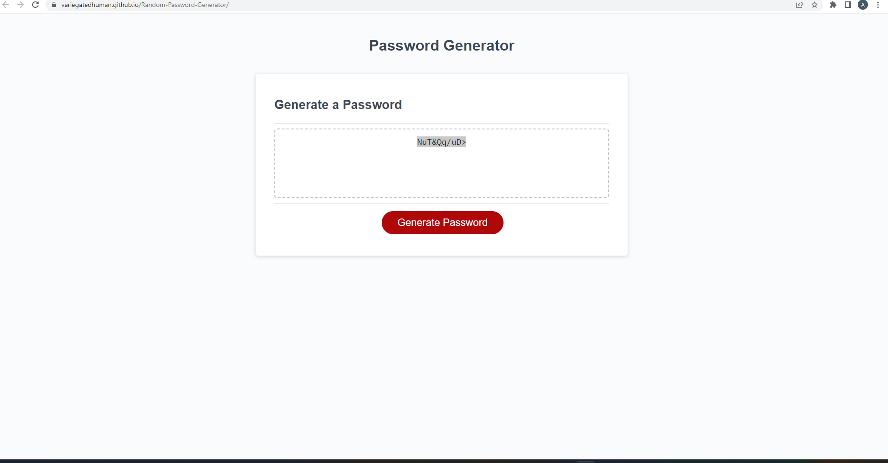

#Random Password Generator

Development and deployment of a Random Password Generator that allows users to specify key criteria for generating a customly designed random password.

##Project Goal

Project fulfills the following criteria:

## Acceptance Criteria

GIVEN I need a new, secure password

WHEN I click the button to generate a password

THEN I am presented with a series of prompts for password criteria

WHEN prompted for password criteria

THEN I select which criteria to include in the password

WHEN prompted for the length of the password

THEN I choose a length of at least 8 characters and no more than 128 characters

WHEN asked for character types to include in the password

THEN I confirm whether or not to include lowercase, uppercase, numeric, and/or special characters

WHEN I answer each prompt

THEN my input should be validated and at least one character type should be selected

WHEN all prompts are answered

THEN a password is generated that matches the selected criteria

WHEN the password is generated

THEN the password is either displayed in an alert or written to the page

##Goal Fulfillment

When "Generate Password" button is clicked the user is presented with a series of prompts to specify password criteria

User is only allowed to create a password equal or greater than 8 characters and less than or equal to 128 characters

User is given the option to choose from a variety of password options; such as numbers, symbols, uppercase letter, and lowercase letters

A minimum of one character type is required to generate a password, otherwise user is presented with an alert regarding invalid criteria

When user is finished deciding password criteria then they are presented with a new, randomly genrated, password directly on the page

##Screenshot of deployed site

##Link to deployed site
https://variegatedhuman.github.io/Random-Password-Generator/

##Authors and acknowledgment
Adam Michell using Triology Bootcamp's starter code

##License
MIT License

##Project status
Complete
